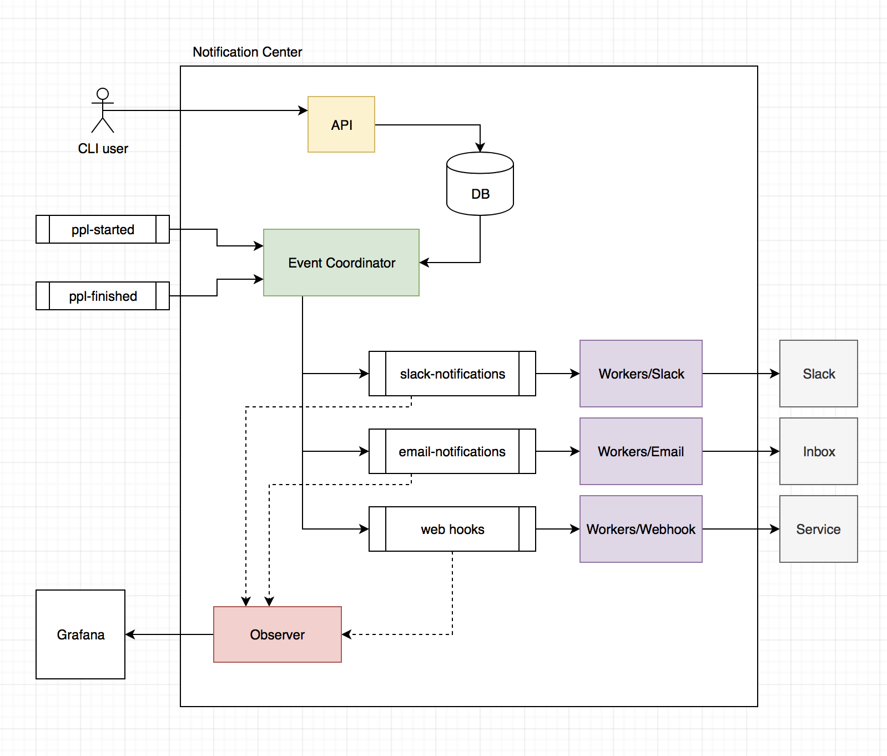

# Notifications Center Architecture

### Components of the system

- __Notificaitons API__: Public API for managing notification settings
- __Event Coordinator__: Filters incoming Rabbit messages from the pipeline system, creates new
  specific messages and ships them to dedicated RabbitMQ queues.
- __Observer__: Observes the states of queues and ships Statsd messages for monitoring and alerting
- __Workers__: Set of workers for processing destination specific messages
   - __Slack Worker__: Ships slack messages
   - __Email Worker__: Ships email messages
   - __Webhook Worker__: Ships email messages
   
The notification service has two data backends:

- A database for storing rules and configuration
- RabbitMQ for passing messages around the system, and queueing

### Microservices vs. Workers

My initial thought process was that every notification type should be a dedicated
service in Semaphore 2.0. This would in theory allow us to add new independent
notification types without dirtying any of the previous services.

While reviewing the specification, and the initial plans for the API, I feel that
a microservice for each type would bring more confusion into the system than clarity.

Benefits of microservices:

- Can be independently delivered and changed
- Have minimal impact on the rest of the system if they are not available
- Easy way to declare dedicated owners

I think that the notification system as a whole perfectly fits the bill here, but I think
that having a dedicated Slack notification service is not ideal.

- To introduce a new notification type, you need to change the main service
- The service can't change its interface easily because it depends on 
  the message types from the main service
- If you want to change the worker, you most likely need to ship a 
  new version of the main notification service
- The slack service is pretty minimal and would be rarely deployed. Corrosion of the delivery
  system is highly likely.
  
For this reason, I propose that the notification service has multiple modules.
Each module coresponds to one notification type, and they share a common set of abstractions
for notification delivery.

Each module can be started/scaled independently of others if necessary, but also bundled 
as a larger deployment bundle.
